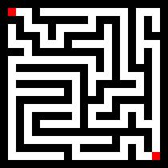
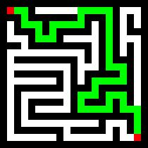

# Maze-generator

## About application

Console utility which provides functionality to generate a maze, solve it, and write the raw maze and the solved one into an image.

## Application features

You can generate maze with HEIGHT and WIDTH parameters.

#### WARNING!
##### Do not create a big maze! You are limited with your RAM.

Application creates folder "maze_gen_results" with 2 .jpg files: pure and solved mazes.

### Example 21x21

- pure maze

- solved maze

## Installation and Using application

### Installation

    $ git clone https://github.com/Elaskinok/maze-generator.git
    $ cd maze-generator
    $ pip3 install .
    
### Using

    $ python main.py [height] [width]

height, width - must be odd integer !
